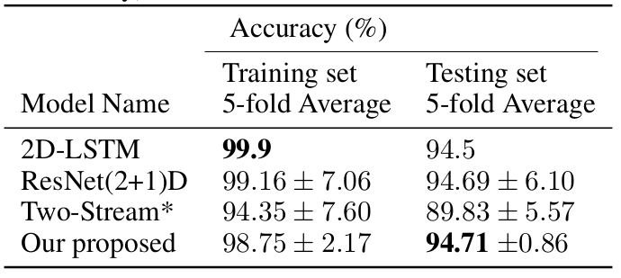
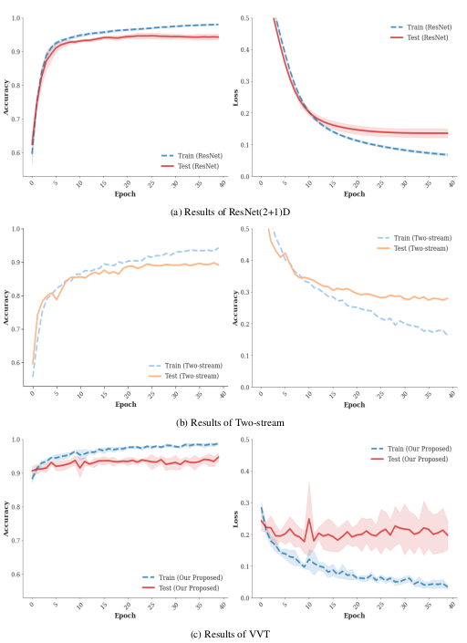
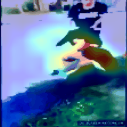
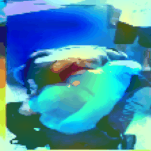

# Vision Transformer on Violence Videos
<br>
<div align="right">Hoe Sung Ryu</div>
<div align="right">Department of Artificial Intelligence</div>
<div align="right">Seoul, Korea</div>
<div align="right">hoesungryu@korea.ac.kr</div>
<br>

## Abstract
> Since videos are a collection of a set of images arranged in a specific order, it is
more ecological validity compared to one single image. Currently, various video
recognition models have been introduced to recognize human actions. In this paper,
we introduce our video recognition model VVT(Video Vision Transformer) which
is based on Efficient-Net and transformer architecture: pre-trained efficient-net
was used for feature extractors from every frame and transformer received the
spatial information while preserving their overall structure in the video. We verify
our model and re-evaluate state-of-the-art architectures on exiting the violence
benchmark dataset. Violence data has two labels(violence v.s nonviolence) with
2000 clips and is collected from realistic, challenging YouTube videos. As a result,
our model outperforms existing methods. We examine the region of interest in
violence situations with the Grad-CAM method.


## Dataset
> We used Real-Life Violence data as a benchmark. The RLVS benchmark consists of
2000 videos divided into 1000 violence clips and 1000 nonviolence clips. The violence clips involve fights in many different environments such as street, prison and schools. The nonviolence videos contain other human actions such as playing football, basketball, tennis, swimming and eating. Part of the RLVS dataset videos are manually captured,however to prevent the redundancy in persons and environment in the captured videos, other videos are collected from YouTube. Download data from here: [Real-Life Violence Situations (RLVS)](https://www.kaggle.com/mohamedmustafa/real-life-violence-situations-dataset)


## Environments Setting

*Python 3.7* and *Pytorch 1.14* is used for this project. You can create new virtual environments following order:

```bash
$ conda create -n vvt python=3.7
$ conda activate vvt
```

The *requirements.txt* file contain all Python libraries needed to learn experiments.

```bash
$ pip install -r requirements.txt
```


## Demo 


## Results
### Architecture comparison 5-fold accuracy on RLVS dataset

<div align="center"></div>

### Train & Test 
<div align="center"></div>

### ResNet3D_gif
<div align="center"></div>

### Our model_gif
<div align="center"></div>


## Cite
Kindly remind, please cite:
```
@inproceedings{
}
```